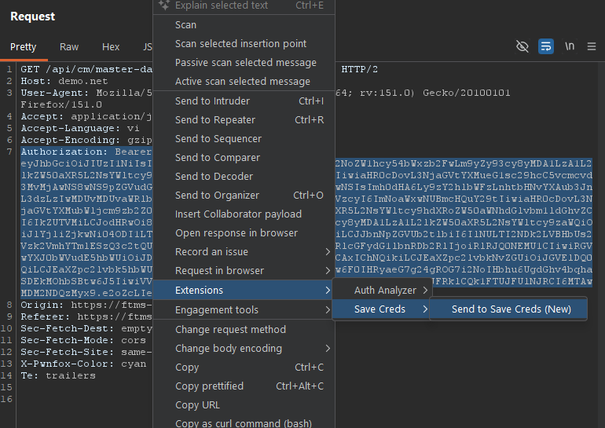
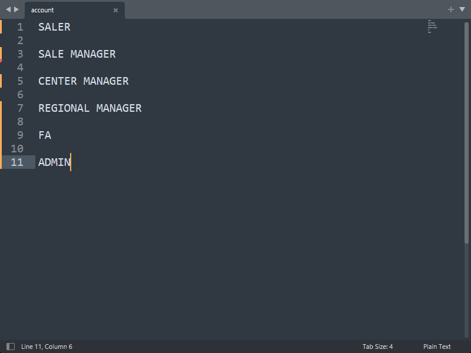
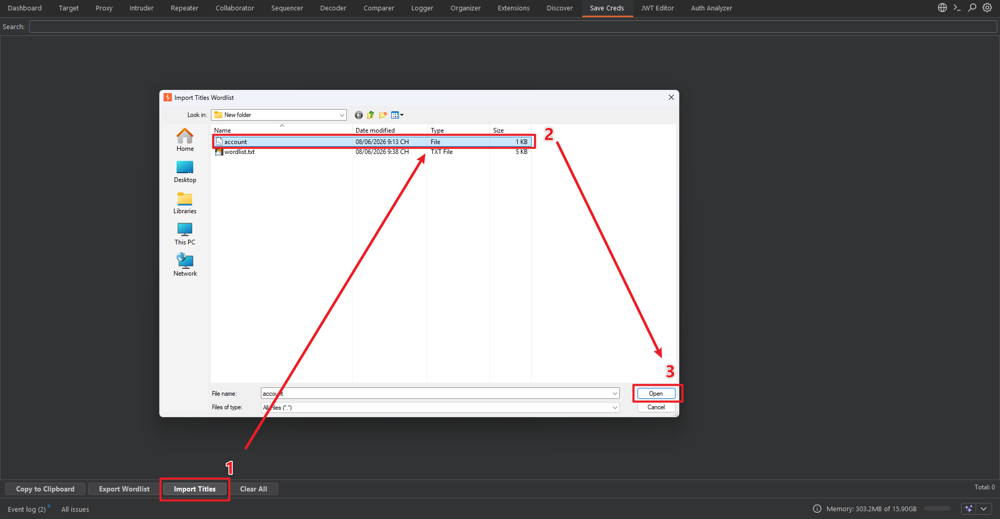
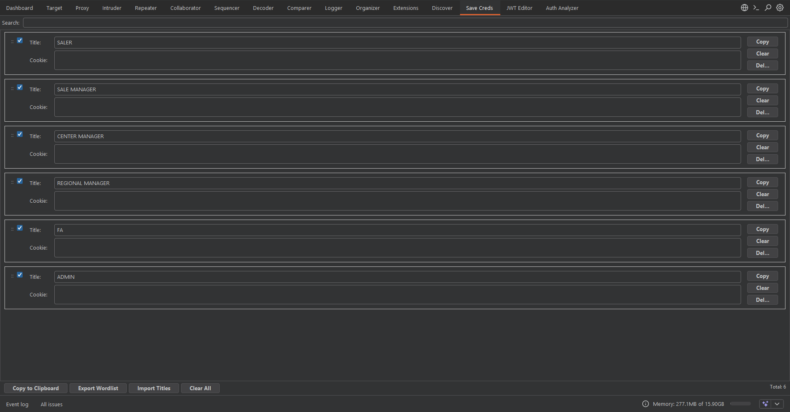
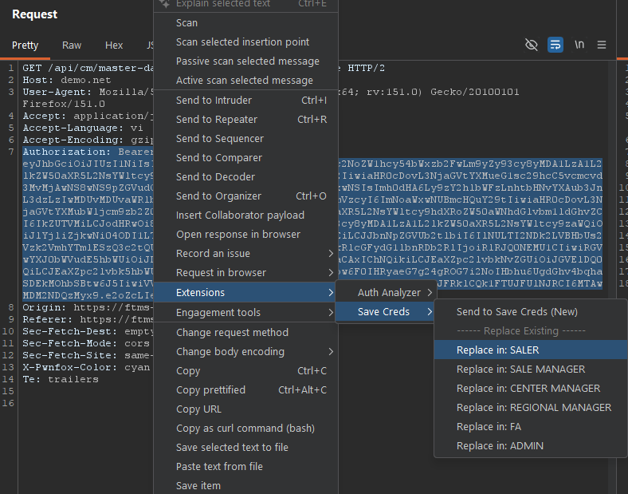
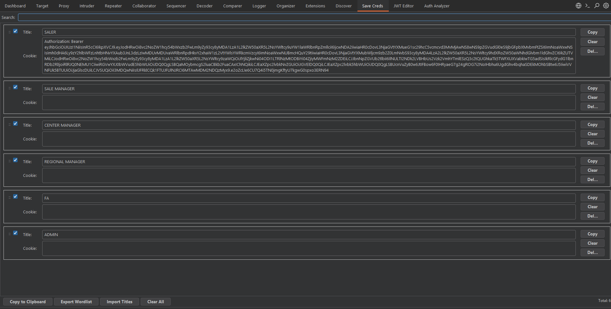
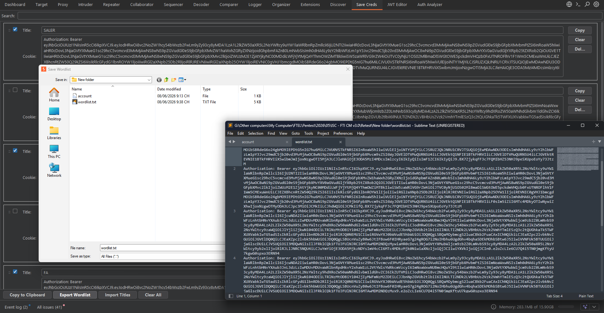

# Save Creds - Burp Suite Extension

**Save Creds** là một extension gọn nhẹ dành cho Burp Suite giúp người dùng thu thập, quản lý và xuất các thông tin định danh (Cookies, Tokens, JWTs) dưới dạng danh sách từ khóa.

---

## 🚀 Tính Năng Nổi Bật

- **Thu Thập Thủ Công Tiện Lợi:** Bôi đen bất kỳ chuỗi ký tự nào trong Burp Suite, click chuột phải và chọn "Send to Save Creds" để thêm vào danh sách.
- **Menu Thay Thế Động:** Hỗ trợ menu chuột phải cho phép thay thế (replace) trực tiếp giá trị vào một block đã có.
- **Giao Diện Thẻ Trực Quan:** 
  - Đặt tiêu đề gợi nhớ cho từng cookie/token.
  - Hiển thị giá trị và cho phép chỉnh sửa trực tiếp trên từng block.
- **Tìm Kiếm Nhanh (Search):** Dễ dàng lọc các block theo tiêu đề hoặc nội dung cookie.
- **Thao Tác Từng Block:** Nút Copy và Clear chuyên dụng cho từng block.
- **Sao Chép và Xuất Chọn Lọc:** 
  - Hỗ trợ checkbox trên từng block. 
  - Sao chép vào Clipboard hoặc xuất ra file `.txt` dạng wordlist chỉ những block đã được chọn.
- **Import Tiêu Đề:** Khởi tạo nhanh các block từ một file danh sách các tên (Wordlist).

---

## 🛠️ Yêu Cầu Hệ Thống

- **Burp Suite**
- **Jython Standalone JAR**

---

## 📦 Hướng Dẫn Cài Đặt

1. Thiết lập Jython trong **Extensions** -> **Extension settings** -> **Python environment**.
2. Truy cập **Extensions** -> **Installed** -> **Add**.
3. Chọn **Extension type:** `Python` và chọn file `savecreds.py` của bạn để nạp.

---

## 📋 Hình ảnh minh họa

1. Send to Save Creds

2. Import
- File import

- Import

3. Add/Replace cookie value

4. Export

 

---

# Save Creds - Burp Suite Extension (English)

**Save Creds** is a lightweight Burp Suite extension that helps users collect, manage, and export credentials (Cookies, Tokens, JWTs) as a wordlist.

---

## 🚀 Key Features

- **Convenient Manual Collection:** Highlight any string in Burp Suite, right-click, and select "Send to Save Creds" to add it to your list.
- **Dynamic Context Menu:** Right-click context menu lets you directly replace the value in any existing block.
- **Intuitive Card-based UI:** 
  - Set a memorable title for each cookie/token.
  - Display values and allow direct editing on each block.
- **Quick Search:** Easily filter blocks by title or cookie content.
- **Per-Block Actions:** Dedicated Copy and Clear buttons for every individual block.
- **Selective Copy and Export:** 
  - Checkboxes supported on each block.
  - Copy to Clipboard or export to a `.txt` wordlist file with only the selected blocks.
- **Import Titles:** Quickly initialize empty blocks from a wordlist file of names.

---

## 🛠️ System Requirements

- **Burp Suite**
- **Jython Standalone JAR**

---

## 📦 Installation Guide

1. Configure Jython in **Extensions** -> **Extension settings** -> **Python environment**.
2. Go to **Extensions** -> **Installed** -> **Add**.
3. Select **Extension type:** `Python` and choose your `savecreds.py` file to load.

---

## 📋 Screenshots

1. Send to Save Creds

2. Import
- File import

- Import

3. Add/Replace cookie value

4. Export
