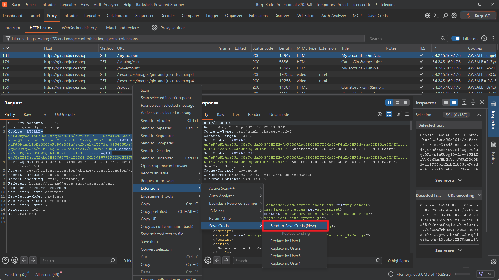
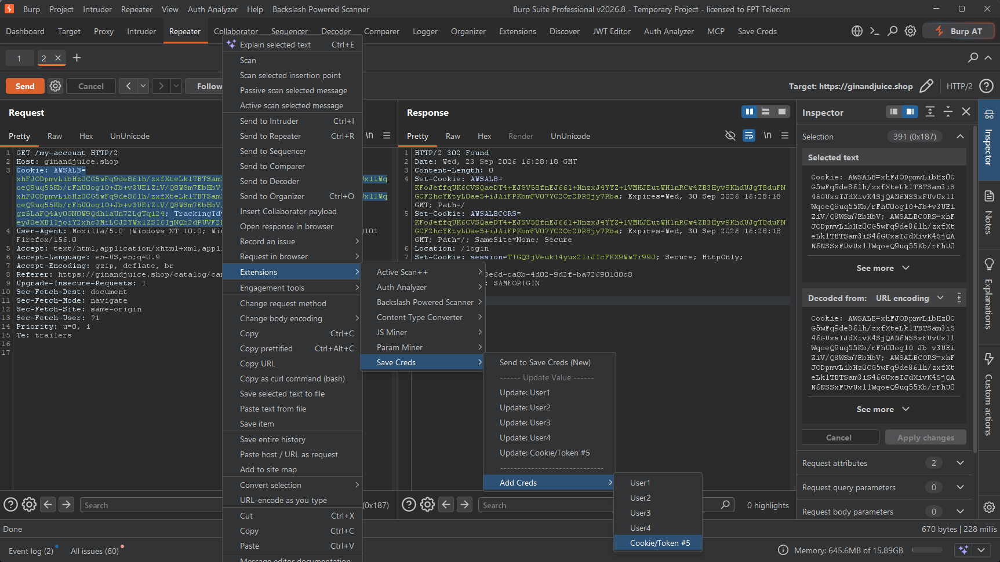
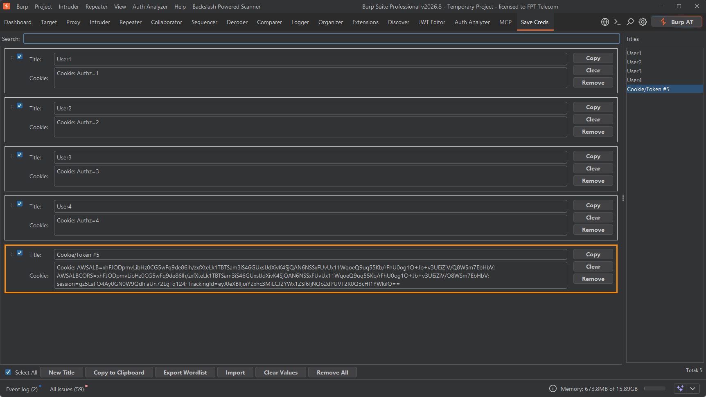
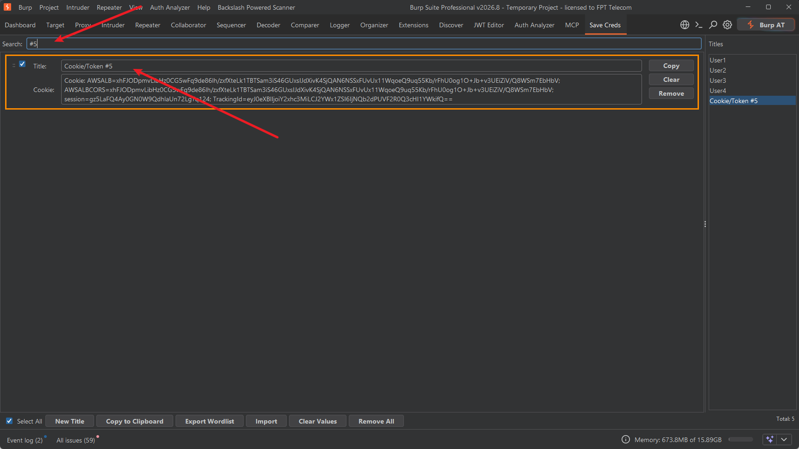

# Save Creds

Extension Burp Suite gọn nhẹ để thu thập, quản lý và sử dụng lại thông tin định danh (cookie, token, JWT) trong quá trình kiểm thử.

A lightweight Burp Suite extension for collecting, organizing, and reusing credentials (cookies, tokens, JWTs) during testing.

**Ngôn ngữ / Language:** [Tiếng Việt](#tiếng-việt) | [English](#english)

---

## Tiếng Việt

### Tổng quan

Save Creds lưu tập trung các giá trị phiên (cookie, token, JWT) thu thập trong quá trình kiểm thử. Bạn có thể lấy giá trị từ bất kỳ request hoặc response nào, đặt tên, rồi chèn lại vào editor chỉ với vài thao tác, hoặc xuất ra wordlist. Công cụ đặc biệt hữu ích khi kiểm thử phân quyền với nhiều tài khoản.

### Tính năng

| Nhóm | Chức năng |
| --- | --- |
| Thu thập | Gửi đoạn văn bản đang bôi đen thành mục mới, hoặc thay giá trị của mục có sẵn, ngay từ menu chuột phải. |
| Sử dụng lại | Chèn giá trị đã lưu vào bất kỳ editor nào của Burp (Repeater, Proxy, v.v.) bằng **Add Creds**. |
| Quản lý | Mỗi mục có title và giá trị chỉnh sửa được, kéo thả để sắp xếp, tìm kiếm tức thời trong title và giá trị. |
| Import | **Titles only** hoặc **Titles + Cookies** (định dạng bên dưới). |
| Export | Xuất các mục đã tích ra file `.txt`, có hoặc không kèm title. |

### Yêu cầu

- Burp Suite (Community hoặc Professional)
- [Jython standalone JAR](https://www.jython.org/download)

### Cài đặt

1. Trong Burp, vào **Extensions** > **Extension settings** > **Python environment** và chọn file Jython standalone JAR.
2. Vào **Extensions** > **Installed** > **Add**.
3. Đặt **Extension type** là `Python`, chọn file `savecreds.py`, rồi nhấn **Next**.

Tab **Save Creds** sẽ xuất hiện sau khi extension được tải.

### Sử dụng

**Thu thập giá trị**
Bôi đen cookie hoặc token ở bất kỳ đâu trong Burp, nhấp chuột phải, chọn **Extensions** > **Save Creds** > **Send to Save Creds (New)**. Để ghi đè một mục có sẵn, chọn **Replace in: \<title\>**.



**Chèn giá trị**
Trong editor của Repeater hoặc Proxy, nhấp chuột phải tại vị trí cần chèn, chọn **Extensions** > **Save Creds** > **Add Creds** > *title*. Nếu đang bôi đen văn bản, đoạn đó sẽ bị thay thế.



**Quản lý các mục**
Trong tab **Save Creds**:

- **New Title** tạo mục trống và đặt con trỏ vào ô title.
- Kéo biểu tượng `::` để sắp xếp lại thứ tự.
- **Copy**, **Clear**, **Remove** tác động lên một mục.
- Ô **Select All** chỉ được tích khi tất cả các mục đều đã tích.
- **Copy to Clipboard** sao chép giá trị của các mục đã tích, mỗi giá trị một dòng.
- **Clear Values** xóa toàn bộ giá trị nhưng giữ lại title. **Remove All** xóa toàn bộ mục.



**Điều hướng**
Danh mục **Titles** bên phải liệt kê mọi mục. Nhấp vào một title để cuộn tới mục đó và làm nổi bật. Kéo thanh chia để đổi độ rộng danh mục.

**Tìm kiếm**
Ô **Search** phía trên lọc các mục theo title hoặc giá trị ngay khi bạn gõ.



### Import và Export

**Import** hỏi định dạng cần dùng rồi mở hộp chọn file.

*Titles only* đọc mỗi dòng là một title và để trống cookie:

```text
User1
User2
User3
```

*Titles + Cookies* đọc các mục cách nhau bằng một dòng trống. Dòng đầu là title, các dòng còn lại là giá trị cookie:

```text
User1
Cookie: Authz=1

User2
Cookie: Authz=2
```

**Export Wordlist** ghi các mục đã tích và có giá trị. Khi bật **Include titles**, mỗi mục được ghi dạng `Title:` rồi giá trị ở dòng kế tiếp, và file xuất theo cách này có thể import lại bằng **Titles + Cookies**. Nếu không bật, chỉ ghi giá trị, mỗi giá trị một dòng.

### Lưu trữ dữ liệu

Dữ liệu được lưu trong phần cài đặt extension của Burp, riêng cho từng project. Extension lưu sau khoảng một giây kể từ mỗi thay đổi và lưu lại khi bị gỡ. Temporary Project giữ dữ liệu trong phiên hiện tại và bị xóa khi đóng project.

---

## English

### Overview

Save Creds keeps the session values you gather while testing in one place. Capture a value from any request or response, give it a name, and insert it back into any editor in a couple of clicks. Values can also be exported as a wordlist. This is useful for access-control testing with several user accounts.

### Features

| Area | Capability |
| --- | --- |
| Capture | Send highlighted text to a new entry, or replace the value of an existing entry, from the right-click menu. |
| Reuse | Insert a saved value into any Burp editor (Repeater, Proxy, and others) with **Add Creds**. |
| Organization | Editable title and value per entry, drag-and-drop ordering, and live search across titles and values. |
| Import | **Titles only**, or **Titles + Cookies** (format below). |
| Export | Export the checked entries to a `.txt` wordlist, with or without titles. |

### Requirements

- Burp Suite (Community or Professional)
- [Jython standalone JAR](https://www.jython.org/download)

### Installation

1. In Burp, open **Extensions** > **Extension settings** > **Python environment** and select the Jython standalone JAR.
2. Open **Extensions** > **Installed** > **Add**.
3. Set **Extension type** to `Python`, select `savecreds.py`, and click **Next**.

A **Save Creds** tab appears when the extension loads.

### Usage

**Collect a value**
Highlight a cookie or token anywhere in Burp, right-click, then choose **Extensions** > **Save Creds** > **Send to Save Creds (New)**. To overwrite an existing entry instead, choose **Replace in: \<title\>**.


**Insert a value**
In a Repeater or Proxy editor, right-click where the value should go, then choose **Extensions** > **Save Creds** > **Add Creds** > *title*. If text is selected, it is replaced.


**Manage entries**
Use the **Save Creds** tab:

- **New Title** adds an empty entry and focuses its title field.
- Drag the `::` handle to reorder entries.
- **Copy**, **Clear**, and **Remove** act on a single entry.
- The **Select All** box is ticked only while every entry is ticked.
- **Copy to Clipboard** copies the values of the ticked entries, one per line.
- **Clear Values** empties every value and keeps the titles. **Remove All** deletes all entries.


**Navigate**
The **Titles** panel on the right lists every entry. Click a title to scroll to its entry and highlight it. Drag the divider to resize the panel.

**Search**
The **Search** box at the top filters entries by title or value as you type.


### Import and Export

**Import** asks which format to use, then opens a file chooser.

*Titles only* reads one title per line and leaves the cookie empty:

```text
User1
User2
User3
```

*Titles + Cookies* reads entries separated by a blank line. The first line is the title. The remaining lines are the cookie value:

```text
User1
Cookie: Authz=1

User2
Cookie: Authz=2
```

**Export Wordlist** writes the ticked entries that have a value. With **Include titles** enabled, each entry is written as `Title:` followed by the value on the next line, and a file exported this way can be imported again with **Titles + Cookies**. Without it, only the values are written, one per line.

### Data Storage

Data is stored with Burp's extension settings, separately for each project, and saved about one second after any change and again when the extension unloads. A Temporary Project keeps its data for the current session and is discarded when the project closes.
